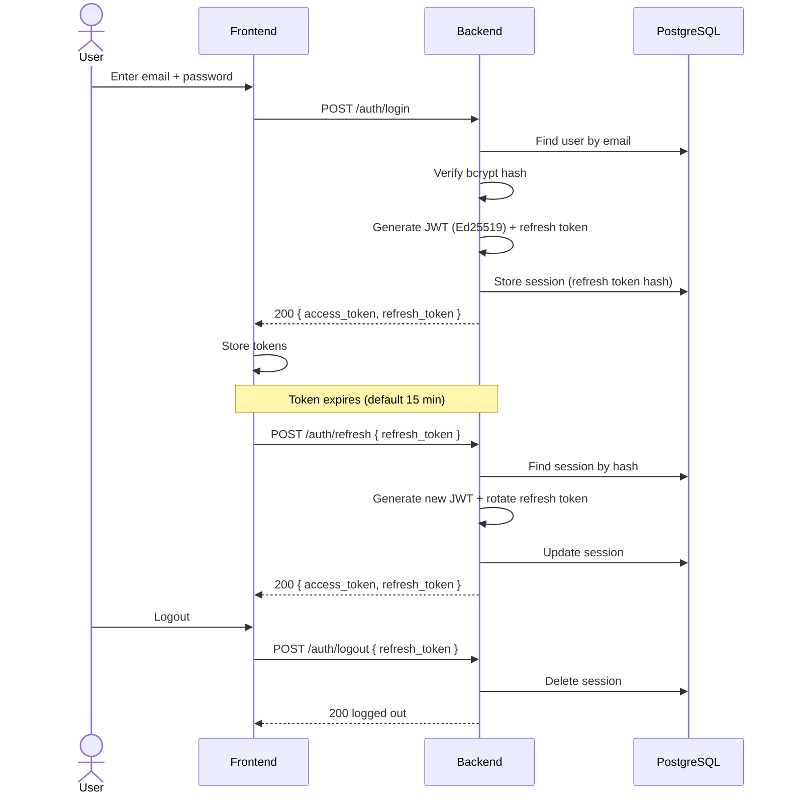
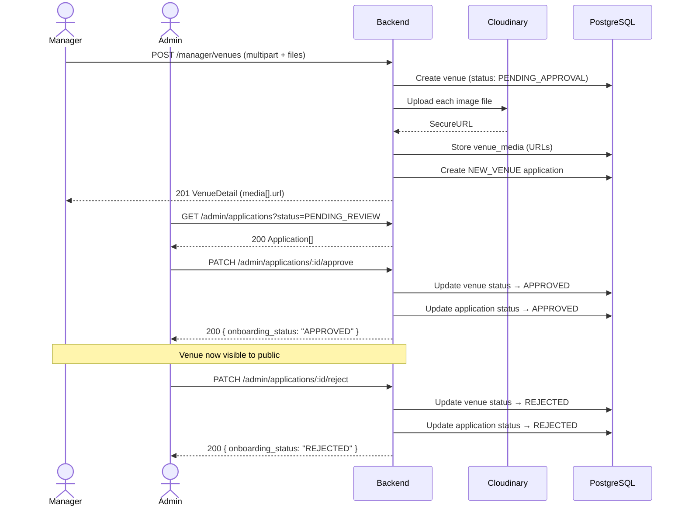
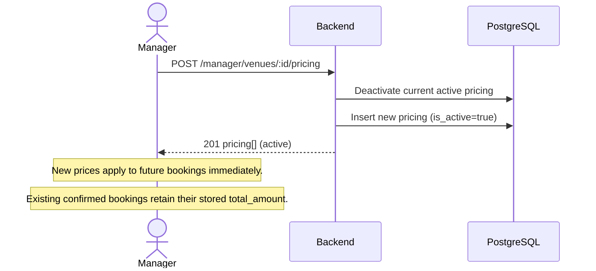
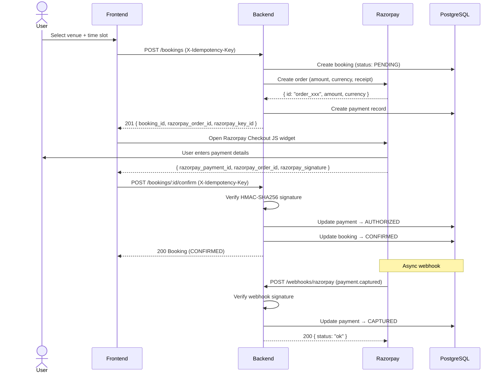
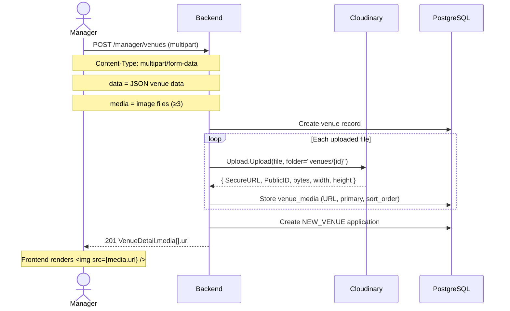

# BookMyVenue — System Design

## 1. Project Overview

BookMyVenue is a venue booking platform built with Go (Gin) on the backend and React/TypeScript on the frontend. It enables venue managers to list and manage venues, admins to approve/ reject applications, and users to browse, book, and pay for venues.

**Tech Stack**

| Layer | Technology |
|---|---|
| Language | Go 1.23 |
| HTTP Framework | Gin |
| Database | PostgreSQL 16 (PostGIS) |
| Image Storage | Cloudinary |
| Payments | Razorpay |
| Auth | JWT (Ed25519) |
| Frontend | React + TypeScript + Vite |

---

## 2. Directory Structure

```
BookMyVenue/
├── .github/
│   └── PULL_REQUEST_TEMPLATE.md
├── .gitignore
├── CONTRIBUTING.md
├── LICENSE
├── README.md
├── backend/
│   ├── .env
│   ├── Makefile
│   ├── README.md
│   ├── docker-compose.yml
│   ├── go.mod
│   ├── cmd/
│   │   └── server/
│   │       └── main.go                  # Entry point
│   ├── docs/
│   │   ├── design.md                    # This file
│   │   ├── docs.go
│   │   ├── swagger.json
│   │   └── swagger.yaml
│   ├── internal/
│   │   ├── config/
│   │   │   └── config.go                # Env-based config loader
│   │   ├── domain/
│   │   │   ├── authRepository.go        # AuthRepo interface
│   │   │   ├── bookings.go              # Booking + BookingRepo interfaces
│   │   │   ├── errors.go                # Domain error sentinels
│   │   │   ├── idempotency.go           # IdempotencyKey + IdempotencyRepo
│   │   │   ├── payments.go              # Payment + PaymentRepo interfaces
│   │   │   ├── razorpay.go              # WebhookEvent, CreateOrder DTOs
│   │   │   ├── user.go                  # User, Role, Session, Request DTOs
│   │   │   ├── venue.go                 # Venue + VenueRepo interface
│   │   │   ├── venue_application.go     # VenueApplication + ApplicationRepo
│   │   │   ├── venue_dto.go             # Request/Response DTOs
│   │   │   ├── venue_media.go           # VenueMedia + MediaRepo interface
│   │   │   └── venue_pricing.go         # VenuePricing + PricingRepo interface
│   │   ├── handler/
│   │   │   ├── authHandler.go           # Register, Login, Refresh, Logout
│   │   │   ├── bookingHandler.go        # CRUD bookings + payment confirm
│   │   │   ├── healthCheck.go           # Health endpoint
│   │   │   ├── routes.go                # Route definitions
│   │   │   ├── server.go                # Server struct + lifecycle
│   │   │   ├── venue.go                 # Venue CRUD + pricing handlers
│   │   │   ├── venueApplication.go      # Application listing + approve/reject
│   │   │   └── webhookHandler.go        # Razorpay webhook receiver
│   │   ├── middlewares/
│   │   │   ├── checkAuth.go             # JWT Bearer token validation
│   │   │   ├── cors.go                  # CORS headers
│   │   │   ├── idempotencyKey.go        # Idempotency enforcement
│   │   │   ├── requestId.go             # X-Request-ID propagation
│   │   │   ├── requestLogger.go         # Structured request logging
│   │   │   └── roleCheck.go             # Role-based access control
│   │   ├── repository/
│   │   │   ├── auth/
│   │   │   │   └── auth.go              # AuthRepository implementation
│   │   │   ├── venue/
│   │   │   │   └── venue.go             # VenueRepository implementation
│   │   │   ├── bookings.go              # BookingRepository implementation
│   │   │   ├── helpers.go               # SQL helper utilities
│   │   │   ├── idempotency.go           # IdempotencyRepository implementation
│   │   │   ├── migrate.go               # DB migration runner
│   │   │   ├── payments.go              # PaymentRepository implementation
│   │   │   ├── postgres.go              # pgx pool setup
│   │   │   ├── venue_application.go     # ApplicationRepository implementation
│   │   │   ├── venue_media.go           # MediaRepository implementation
│   │   │   ├── venue_pricing.go         # PricingRepository implementation
│   │   │   └── migrations/
│   │   │       ├── 001_create_users_table.up.sql
│   │   │       ├── 001_create_users_table.down.sql
│   │   │       ├── 002_create_user_identities_table.up.sql
│   │   │       ├── 002_create_user_identities_table.down.sql
│   │   │       ├── 003_sessions_table.up.sql
│   │   │       ├── 003_sessions_table.down.sql
│   │   │       ├── 004_create_venue_table.up.sql
│   │   │       ├── 004_create_venue_table.down.sql
│   │   │       ├── 005_create_venue_pricing_table.up.sql
│   │   │       ├── 005_create_venue_pricing_table.down.sql
│   │   │       ├── 006_create_booking_table.up.sql
│   │   │       ├── 006_create_booking_table.down.sql
│   │   │       ├── 007_create_payments_table.up.sql
│   │   │       ├── 007_create_payments_table.down.sql
│   │   │       ├── 008_idempotency_key_table.up.sql
│   │   │       ├── 008_idempotency_key_table.down.sql
│   │   │       ├── 009_create_venue_media_table.up.sql
│   │   │       ├── 009_create_venue_media_table.down.sql
│   │   │       ├── 010_add_booking_payment_fk.up.sql
│   │   │       ├── 010_add_booking_payment_fk.down.sql
│   │   │       ├── 011_create_venue_application_table.up.sql
│   │   │       ├── 011_create_venue_application_table.down.sql
│   │   │       ├── 012_add_cancelled_by_to_bookings.up.sql
│   │   │       └── 012_add_cancelled_by_to_bookings.down.sql
│   │   └── services/
│   │       ├── authService/
│   │       │   ├── auth.go              # Registration, password hashing
│   │       │   └── tokens.go            # JWT + refresh token logic
│   │       ├── bookingService/
│   │       │   └── booking.go           # Booking + payment confirmation
│   │       ├── mediaService/
│   │       │   └── media.go             # Cloudinary upload/delete
│   │       ├── razorpayService/
│   │       │   └── razorpay.go          # Razorpay API client + webhook verify
│   │       └── venueService/
│   │           └── venue.go             # Venue + application logic
│   └── pkg/
│       └── logger/
│           └── logger.go                # slog logger setup
├── userFrontend/                        # React/TypeScript frontend
│   ├── src/
│   │   ├── api/                         # Axios config + endpoint helpers
│   │   ├── app/                         # Router, providers, stores
│   │   ├── components/                  # Shared UI components
│   │   ├── features/                    # Feature modules (auth, booking, venues, etc.)
│   │   ├── hooks/                       # Custom React hooks
│   │   ├── types/                       # TypeScript type definitions
│   │   └── utils/                       # Utility functions
```

---

## 3. Config & Environment

All configuration is loaded from environment variables (`.env`) in `internal/config/config.go`.

| Field | Env Variable | Type | Required | Default |
|---|---|---|---|---|
| `Host` | `HOST` | string | No | `"0.0.0.0"` |
| `Port` | `PORT` | string | No | `"8081"` |
| `ReadTimeout` | `READ_TIMEOUT` | duration | No | `30s` |
| `WriteTimeout` | `WRITE_TIMEOUT` | duration | No | `60s` |
| `IdleTimeout` | `IDLE_TIMEOUT` | duration | No | `120s` |
| `ShutdownTimeout` | `SHUTDOWN_TIMEOUT` | duration | No | `60s` |
| `ReadHeaderTimeout` | `READ_HEADER_TIMEOUT` | duration | No | `2s` |
| `DatabaseURL` | `DATABASE_URL` | string | **Yes** | — |
| `DBMaxConns` | `DB_MAX_CONNS` | int32 | No | `25` |
| `DBMinConns` | `DB_MIN_CONNS` | int32 | No | `5` |
| `DBMaxConnIdle` | `DB_MAX_CONN_IDLE` | duration | No | `30m` |
| `Environment` | `ENVIRONMENT` | string | No | `"development"` |
| `EncryptionKey` | `ENCRYPTION_KEY` | 32 bytes hex | **Yes** | — |
| `AllowedOrigins` | `ALLOWED_ORIGINS` | comma-separated | No | `"http://localhost:5173,http://localhost:3000"` |
| `JWTPrivateKey` | `JWT_PRIVATE_KEY` | base64 Ed25519 | **Yes** | — |
| `JWTPublicKey` | `JWT_PUBLIC_KEY` | base64 Ed25519 | **Yes** | — |
| `JWTExpiry` | `JWT_EXPIRY` | duration | No | `15m` |
| `RefreshExpiry` | `REFRESH_EXPIRY` | duration | No | `168h` (7 days) |
| `CloudinaryCloudName` | `CLOUDINARY_API_NAME` | string | **Yes** | — |
| `CloudinaryAPIKey` | `CLOUDINARY_API_KEY` | string | **Yes** | — |
| `CloudinaryAPISecret` | `CLOUDINARY_API_SECRET` | string | **Yes** | — |
| `RazorpayKeyID` | `RAZORPAY_TEST_API_KEY` | string | **Yes** | — |
| `RazorpayKeySecret` | `RAZORPAY_TEST_API_SECRET` | string | **Yes** | — |
| `RazorpayWebhookSecret` | `RAZORPAY_TEST_WEBHOOK_SECRET` | string | No | falls back to `RazorpayKeySecret` |

---

## 4. Route Map

Every route with happy path (success response) and all failure paths (status code + condition).

| Audience | Sections | Route Group | Purpose |
|---|---|---|---|
| **Public** | 4.1, 4.2, 4.3, 4.4, 4.9 | `/health`, `/api/v1/auth/*`, `/api/v1/venues/*`, `/api/v1/webhooks/razorpay`, `/swagger/*` | Health check, register/login, browse venues, webhooks, API docs |
| **User** (any auth) | 4.7 | `/api/v1/bookings/*` | Create/confirm/list/cancel own bookings |
| **Venue Manager** | 4.5, 4.8 | `/api/v1/manager/venues/*`, `/api/v1/manager/bookings/*` | Manage venues/pricing, view venue bookings |
| **Admin** | 4.6 | `/api/v1/admin/*` | List all venues, approve/reject applications |

### 4.1 Health [Public]

```
GET /health
  Handler:  healthCheck.go (healthCheckHandler)
  Auth:     None
  Success:  200 → {"status":"ok","database":"up"}
  Failures: 503 → database unreachable
```

### 4.2 Auth — `/api/v1/auth` [Public]

#### POST /api/v1/auth/register
```
  Handler:  authHandler.go:22 (registerHandler)
  Auth:     None
  Body:     { email, password, phone, role, full_name? }
  Success:  201 → UserDB
  Failures:
    400 → invalid JSON body, missing fields, password too short, invalid role
    409 → email or phone already exists
```

#### POST /api/v1/auth/login
```
  Handler:  authHandler.go:61 (loginHandler)
  Auth:     None
  Body:     { email, password }
  Success:  200 → { access_token, refresh_token, expires_in }
  Failures:
    400 → invalid JSON body
    401 → wrong email or password
```

#### POST /api/v1/auth/refresh
```
  Handler:  authHandler.go:96 (refreshHandler)
  Auth:     None
  Body:     { refresh_token } (or cookie)
  Success:  200 → { access_token, refresh_token, expires_in }
  Failures:
    400 → no refresh token provided
    401 → invalid/expired/session-not-found
```

#### POST /api/v1/auth/logout
```
  Handler:  authHandler.go:140 (logoutHandler)
  Auth:     None
  Body:     { refresh_token } (or cookie)
  Success:  200 → { message: "successfully logged out" }
  Failures:
    400 → no refresh token provided
    500 → repository error
```

### 4.3 Public Venues — `/api/v1/venues` [Public]

#### GET /api/v1/venues
```
  Handler:  venue.go:368 (listVenuesHandler)
  Auth:     None
  Query:    ?state=&district=&city=&venue_type=  (all optional)
  Success:  200 → VenueListItem[]
    (only APPROVED venues; each item includes primary_image URL)
  Failures: 500 → database error
```

#### GET /api/v1/venues/:venue_id
```
  Handler:  venue.go:396 (getVenueByIDHandler)
  Auth:     None
  Param:    venue_id (UUID)
  Success:  200 → VenueDetail (includes media[] with image URLs, pricing)
  Failures:
    400 → invalid venue_id (not a UUID)
    404 → venue not found or not APPROVED
    500 → database error
```

### 4.4 Razorpay Webhook — `/api/v1/webhooks/razorpay` [Public]

#### POST /api/v1/webhooks/razorpay
```
  Handler:  webhookHandler.go:12 (razorpayWebhookHandler)
  Auth:     None (signature-based)
  Headers:  X-Razorpay-Signature, X-Razorpay-Webhook-Timestamp
  Body:     Raw JSON (WebhookEvent)
  Success:  200 → { status: "ok" }  (also on unknown events)
  Failures:
    400 → empty body or unreadable body
    401 → invalid/missing webhook signature
```

### 4.5 Manager Venues — `/api/v1/manager/venues` [Manager]

All manager routes require: `Authorization: Bearer <token>` + role `venue_manager`.

#### POST /api/v1/manager/venues
```
  Handler:  venue.go:17 (createManagerVenueHandler)
  Auth:     venue_manager
  Body:     multipart/form-data OR application/json
  Multipart fields:
    - data: JSON string (CreateVenueRequest without media.URLs)
    - media: file[] (at least 3 image files, uploaded to Cloudinary)
  JSON fields:
    - venue_name, addressline_1, phone, email (required)
    - media[].url (at least 3 pre-existing URLs)
    - media[].primary, media[].sort_order
    - pricing[].price_per_hour, pricing[].start_date
  Success:  201 → VenueDetail (media includes Cloudinary SecureURLs)
  Failures:
    400 → missing required fields, <3 images, invalid durations
    401 → unauthorized
    500 → venue creation failed, Cloudinary upload failed
```

#### GET /api/v1/manager/venues
```
  Handler:  venue.go:157 (listManagerVenuesHandler)
  Auth:     venue_manager
  Success:  200 → VenueListItem[] (scoped to owner)
  Failures:
    401 → unauthorized
    500 → database error
```

#### GET /api/v1/manager/venues/:venue_id
```
  Handler:  venue.go:179 (getManagerVenueByIDHandler)
  Auth:     venue_manager
  Param:    venue_id (UUID)
  Success:  200 → VenueDetail (any status, including PENDING_APPROVAL)
  Failures:
    400 → invalid venue_id
    404 → venue not found
    500 → database error
```

#### PATCH /api/v1/manager/venues/:venue_id
```
  Handler:  venue.go:201 (updateManagerVenueHandler)
  Auth:     venue_manager
  Body:     { venue_name?, addressline_1?, phone?, email?, ... }
  Success:  200 → VenueDetail
  Failures:
    400 → invalid venue_id, invalid duration fields
    401 → unauthorized
    403 → not the owner, venue not in PENDING_APPROVAL
    404 → venue not found
    500 → database error
```

#### GET /api/v1/manager/venues/applications
```
  Handler:  venueApplication.go:27 (listManagerApplicationsHandler)
  Auth:     venue_manager
  Success:  200 → VenueApplication[]
  Failures:
    401 → unauthorized
    500 → database error
```

#### GET /api/v1/manager/venues/:venue_id/pricing
```
  Handler:  venue.go:448 (getManagerVenuePricingHandler)
  Auth:     venue_manager
  Param:    venue_id (UUID)
  Success:  200 → VenuePricing[] (all pricing rows, including inactive)
  Failures:
    400 → invalid venue_id
    500 → database error
```

#### POST /api/v1/manager/venues/:venue_id/pricing
```
  Handler:  venue.go:466 (createManagerVenuePricingHandler)
  Auth:     venue_manager
  Body:     [{ price_per_hour, is_weekend, currency, start_date, end_date? }]
  Success:  201 → VenuePricing[] (active pricing)
    Previous active pricing is deactivated; new pricing takes effect immediately.
    Existing bookings are not affected (their total_amount is already stored).
  Failures:
    400 → invalid venue_id, empty array, invalid JSON
    401 → unauthorized
    500 → database error
```

### 4.6 Admin — `/api/v1/admin` [Admin]

All admin routes require: `Authorization: Bearer <token>` + role `admin`.

#### GET /api/v1/admin/venues
```
  Handler:  venue.go:338 (listAdminVenuesHandler)
  Auth:     admin
  Query:    ?onboarding_status=&state=&district=&owner_id=  (all optional)
  Success:  200 → VenueListItem[] (all venues, any status)
  Failures:
    401 → unauthorized
    403 → wrong role
    500 → database error
```

#### GET /api/v1/admin/applications
```
  Handler:  venueApplication.go:10 (listAdminApplicationsHandler)
  Auth:     admin
  Query:    ?status=  (default: PENDING_REVIEW)
  Success:  200 → VenueApplication[]
  Failures:
    401 → unauthorized
    403 → wrong role
    500 → database error
```

#### GET /api/v1/admin/applications/:application_id
```
  Handler:  venueApplication.go:45 (getApplicationByIDHandler)
  Auth:     admin
  Param:    application_id (UUID)
  Success:  200 → VenueApplication
  Failures:
    400 → invalid application_id
    401 → unauthorized
    403 → wrong role
    500 → database error
```

#### PATCH /api/v1/admin/applications/:application_id/approve
```
  Handler:  venueApplication.go:62 (approveApplicationByIDHandler)
  Auth:     admin
  Body:     { notes? }
  Success:  200 → { application_id, venue_id, onboarding_status, status }
    Venue → APPROVED, application → APPROVED
  Failures:
    400 → invalid application_id
    401 → unauthorized
    403 → wrong role
    500 → database/service error
```

#### PATCH /api/v1/admin/applications/:application_id/reject
```
  Handler:  venueApplication.go:105 (rejectApplicationByIDHandler)
  Auth:     admin
  Body:     { notes }  (required, rejection reason)
  Success:  200 → { application_id, venue_id, onboarding_status, status }
    Venue → REJECTED, application → REJECTED
  Failures:
    400 → invalid application_id, missing rejection notes
    401 → unauthorized
    403 → wrong role
    500 → database/service error
```

### 4.7 Bookings — `/api/v1/bookings` [User]

All booking routes require: `Authorization: Bearer <token>` (any authenticated role).

#### POST /api/v1/bookings
```
  Handler:  bookingHandler.go:13 (createBookingHandler)
  Auth:     Any authenticated user
  Headers:  X-Idempotency-Key (UUID, optional — auto-generated if missing)
  Body:     { venue_id, start_time, end_time, guest_count, special_requests? }
  Success:  201 → CreateBookingResponse
    (includes booking_id, razorpay_order_id, razorpay_key_id,
     total_amount, expires_at)
  Failures:
    400 → missing/invalid fields, end_time before start_time, guest_count < 1
    401 → unauthorized
    403 → venue not approved
    404 → venue not found
    409 → venue not available for requested slot
    500 → service error
    409 (idempotency) → duplicate key still pending
```

#### POST /api/v1/bookings/:booking_id/confirm
```
  Handler:  bookingHandler.go:64 (confirmPaymentHandler)
  Auth:     Any authenticated user
  Headers:  X-Idempotency-Key (UUID)
  Body:     { razorpay_payment_id, razorpay_order_id, razorpay_signature }
  Success:  200 → Booking (CONFIRMED status)
  Failures:
    400 → missing booking_id, missing required razorpay fields,
          payment verification failed (bad signature)
    401 → unauthorized
    409 → payment already processed, booking already confirmed
    500 → service error
```

#### GET /api/v1/bookings
```
  Handler:  bookingHandler.go:106 (listBookingsHandler)
  Auth:     Any authenticated user
  Query:    ?status=CONFIRMED,PENDING&limit=10&offset=0  (all optional)
  Success:  200 → { bookings: Booking[], total, limit, offset }
  Failures:
    401 → unauthorized
    500 → database error
```

#### GET /api/v1/bookings/:booking_id
```
  Handler:  bookingHandler.go:150 (getBookingByIDHandler)
  Auth:     Any authenticated user
  Param:    booking_id (UUID)
  Success:  200 → Booking
  Failures:
    400 → missing booking_id
    401 → unauthorized
    403 → booking does not belong to the user
    404 → booking not found
    500 → database error
```

#### DELETE /api/v1/bookings/:booking_id
```
  Handler:  bookingHandler.go:184 (cancelBookingHandler)
  Auth:     Any authenticated user
  Body:     { reason } (min 5 characters)
  Success:  200 → CancelBookingResponse
  Failures:
    400 → missing booking_id, invalid reason
    401 → unauthorized
    404 → booking not found or not cancellable
    500 → service error
```

### 4.8 Manager Bookings — `/api/v1/manager/bookings` [Manager]

All manager booking routes require: `Authorization: Bearer <token>` + role `venue_manager`.

#### GET /api/v1/manager/bookings
```
  Handler:  bookingHandler.go (listManagerBookingsHandler)
  Auth:     venue_manager
  Query:    ?status=CONFIRMED,PENDING&limit=10&offset=0  (all optional)
  Success:  200 → { bookings: Booking[], total, limit, offset }
    Returns all bookings for venues owned by the manager.
  Failures:
    401 → unauthorized
    403 → wrong role
    500 → database error
```

#### GET /api/v1/manager/bookings/upcoming
```
  Handler:  bookingHandler.go (listManagerUpcomingBookingsHandler)
  Auth:     venue_manager
  Query:    ?limit=10&offset=0  (all optional)
  Success:  200 → { bookings: Booking[], total, limit, offset }
    Returns future bookings (start_time > now, PENDING/CONFIRMED only).
  Failures:
    401 → unauthorized
    403 → wrong role
    500 → database error
```

#### GET /api/v1/manager/bookings/ongoing
```
  Handler:  bookingHandler.go (listManagerOngoingBookingsHandler)
  Auth:     venue_manager
  Query:    ?limit=10&offset=0  (all optional)
  Success:  200 → { bookings: Booking[], total, limit, offset }
    Returns currently active bookings (now between start_time and end_time, PENDING/CONFIRMED only).
  Failures:
    401 → unauthorized
    403 → wrong role
    500 → database error
```

#### GET /api/v1/manager/bookings/venue/:venue_id
```
  Handler:  bookingHandler.go (listManagerVenueBookingsHandler)
  Auth:     venue_manager
  Param:    venue_id (UUID)
  Query:    ?status=CONFIRMED,PENDING&limit=10&offset=0  (all optional)
  Success:  200 → { bookings: ManagerBookingItem[], total, limit, offset }
    Each item includes: booking_id, venue_id, venue_name, user_id,
    user_name, user_email, user_phone, start_time, end_time, total_amount,
    currency, status, guest_count, booking_reference, created_at.
    Ownership is enforced server-side (venue must belong to the manager).
  Failures:
    400 → invalid venue_id
    401 → unauthorized
    403 → wrong role
    500 → database error
```

#### GET /api/v1/manager/bookings/:booking_id
```
  Handler:  bookingHandler.go (getManagerBookingDetailHandler)
  Auth:     venue_manager
  Param:    booking_id (UUID)
  Success:  200 → ManagerBookingDetail
    Returns full booking details including venue_name, user_name,
    user_email, user_phone, payment status (razorpay_order_id, razorpay_payment_id,
    payment_status), special_requests, cancellation info, timestamps.
    Ownership enforced (booking's venue must belong to the manager).
  Failures:
    400 → invalid booking_id
    401 → unauthorized
    403 → wrong role
    404 → booking not found
    500 → database error
```

### 4.9 Swagger [Public]

```
GET /swagger/*any
  Handler:  ginSwagger.WrapHandler (auto-generated)
  Auth:     None
  Success:  200 → Swagger UI HTML
```

---

## 5. Middleware Chain

Applied globally to every route in this order:

1. **gin.Recovery()** — panic recovery, returns 500
2. **CORS** — allows configured origins, handles OPTIONS preflight (204)
3. **RequestID** — injects/propagates `X-Request-ID`
4. **RequestLogger** — logs method, path, status, duration, client IP, request ID

Per-group middleware:

| Route Group | Middleware |
|---|---|
| `/api/v1/auth/*` | (none) |
| `/api/v1/venues/*` | (none) |
| `/api/v1/webhooks/razorpay` | (none — signature is auth) |
| `/api/v1/manager/*` | RequireAuth + RequireRoles(venue_manager) |
| `/api/v1/admin/*` | RequireAuth + RequireRoles(admin) |
| `/api/v1/bookings` | RequireAuth |
| `/api/v1/bookings POST` (create) | RequireAuth + IdempotencyKey |
| `/api/v1/bookings/:id/confirm` | RequireAuth + IdempotencyKey |
| `/api/v1/manager/bookings/*` | RequireAuth + RequireRoles(venue_manager) |

---

## 6. External Services

### 6.1 Cloudinary (Image Storage)

| Detail | Value |
|---|---|
| Library | `github.com/cloudinary/cloudinary-go/v2` |
| Purpose | Upload venue images, generate secure URLs, delete assets |
| Auth | `CLOUDINARY_API_NAME` + `CLOUDINARY_API_KEY` + `CLOUDINARY_API_SECRET` |
| Upload path | `venues/{venue_id}/{filename}` |
| Returned | `SecureURL`, `PublicID`, dimensions, format |

**Flow:** Multipart file → backend → `cloudinary.Upload.Upload()` → `SecureURL` → stored in `venue_media.url`

### 6.2 Razorpay (Payments)

| Detail | Value |
|---|---|
| Integration | HTTP API (orders) + Webhook (events) |
| Purpose | Create payment orders, verify payment signatures, process webhooks |
| Auth | `RAZORPAY_TEST_API_KEY` + `RAZORPAY_TEST_API_SECRET` |

**Order flow:** `POST /bookings` → backend calls Razorpay orders API → returns `razorpay_order_id`

**Confirm flow:** User pays → Razorpay returns `payment_id` + `order_id` + `signature` → `POST /bookings/:id/confirm` → backend verifies HMAC-SHA256 signature → booking CONFIRMED

**Webhook flow:** Razorpay POSTs to `/webhooks/razorpay` → backend verifies `X-Razorpay-Signature` using HMAC-SHA256 → processes `payment.captured` / `payment.failed`

### 6.3 PostgreSQL (Primary Database)

| Detail | Value |
|---|---|
| Library | `github.com/jackc/pgx/v5` (pgxpool) |
| Extension | PostGIS 3.4 (geography type) |
| Connection | `DATABASE_URL` env var |
| Migrations | `golang-migrate/migrate/v4` with 12 migration files |

### 6.4 JWT (Ed25519)

| Detail | Value |
|---|---|
| Library | `github.com/golang-jwt/jwt/v5` |
| Algorithm | EdDSA (Ed25519) |
| Keys | Base64-encoded in `JWT_PRIVATE_KEY` / `JWT_PUBLIC_KEY` |
| Access token | Short-lived (default 15 min) |
| Refresh token | Long-lived (default 7 days), stored as bcrypt hash in DB sessions table |

---

## 7. Domain Types

### Core types:

| Type | File | Key Fields |
|---|---|---|
| `UserDB` | `user.go` | ID, Email, HashedPassword, Phone, Role, FullName |
| `Venue` | `venue.go` | VenueID, OwnerID, OnboardingStatus, Location, VenueName, City, State |
| `VenueMedia` | `venue_media.go` | MediaID, VenueID, URL, Primary, SortOrder |
| `VenuePricing` | `venue_pricing.go` | ID, VenueID, PricePerHour, IsWeekend, IsActive, StartDate, EndDate |
| `VenueApplication` | `venue_application.go` | ApplicationID, VenueID, OwnerID, Type (NEW_VENUE), Status |
| `Booking` | `bookings.go` | ID, VenueID, UserID, StartTime, EndTime, Status, TotalAmount, BookingReference |
| `Payment` | `payments.go` | ID, BookingID, RazorpayOrderID, RazorpayPaymentID, Amount, Status |

### Enums:

| Enum | Values |
|---|---|
| `Role` | `user`, `venue_manager`, `admin` |
| `OnboardingStatus` | `PENDING_APPROVAL`, `APPROVED`, `REJECTED` |
| `ApplicationType` | `NEW_VENUE` |
| `ApplicationStatus` | `PENDING_REVIEW`, `APPROVED`, `REJECTED`, `CANCELLED` |
| `BookingStatus` | `PENDING`, `CONFIRMED`, `COMPLETED`, `CANCELLED`, `NO_SHOW` |
| `PaymentStatus` | `PENDING`, `AUTHORIZED`, `CAPTURED`, `FAILED`, `REFUNDED` |

---

## 8. Workflow Diagrams

### 8.1 Authentication Flow



### 8.2 Venue Onboarding Flow



### 8.3 Pricing Update Flow

Pricing changes take effect immediately without admin approval.



### 8.4 Booking + Payment Flow



### 8.5 Image Upload Flow



---

## 9. Architecture Layers

```
┌─────────────────────────────────────────────────┐
│                  Middleware                      │
│  Recovery → CORS → RequestID → Logger           │
│  → [RequireAuth → RoleCheck]                    │
│  → [IdempotencyKey]                             │
├─────────────────────────────────────────────────┤
│                  Handlers                        │
│  authHandler / venue.go / venueApplication.go   │
│  bookingHandler / webhookHandler                │
├─────────────────────────────────────────────────┤
│                  Services                        │
│  authService / venueService / bookingService     │
│  mediaService / razorpayService                  │
├─────────────────────────────────────────────────┤
│               Repositories                       │
│  auth / venue / venue_pricing / venue_media      │
│  venue_application / bookings / payments         │
│  idempotency                                     │
├─────────────────────────────────────────────────┤
│              External Services                   │
│  PostgreSQL (pgx)   Cloudinary   Razorpay API    │
└─────────────────────────────────────────────────┘
```

**Dependency direction:** Handlers → Services → Repositories → Database. Domain types are shared across all layers. Each layer depends on interfaces defined in `domain/`.

---

## 10. Database Schema (Migrations)

13 migration files in `internal/repository/migrations/`:

| # | Table | Purpose |
|---|---|---|
| 001 | `users` | Core user records (email, password hash, phone, role) — full_name added in 013 |
| 002 | `user_identities` | Additional user metadata |
| 003 | `sessions` | Refresh token sessions (bcrypt hash, expiry) |
| 004 | `venues` | Venue records (location as PostGIS geography, onboarding status) |
| 005 | `venue_pricing` | Pricing tiers (price per hour, active flag, date range) |
| 006 | `bookings` | Booking records (time range as tstzrange, status) |
| 007 | `payments` | Payment records (razorpay IDs, status, webhook payload) |
| 008 | `idempotency_keys` | Idempotency keys for safe retries |
| 009 | `venue_media` | Venue images (Cloudinary URL, primary flag, sort order) |
| 010 | — | Add FK from bookings.payment_id to payments.id |
| 011 | `venue_application` | Onboarding applications (type, status) |
| 012 | — | Add cancelled_by column to bookings |
| 013 | — | Add full_name column to users |

---

## 11. Error Handling

All domain errors are sentinel errors defined in `domain/errors.go`. Handlers map them to HTTP status codes:

| Domain Error | HTTP Status |
|---|---|
| `ErrTokenInvalid`, `ErrTokenExpired` | 401 |
| `ErrInvalidEmailOrPassword` | 401 |
| `ErrUserWithTheEmailAlreadyExist` | 409 |
| `ErrUserWithThePhoneAlreadyExist` | 409 |
| `ErrVenueNotFound` | 404 |
| `ErrVenueNotAvailableInTime` | 409 |
| `ErrVenueNotApproved` | 403 |
| `ErrBookingConflict` | 409 |
| `ErrPaymentUpdateConflict` | 409 |
| `ErrBookingFailed` | 404 |
| `ErrMediaUploadFailed` | 500 |
| `ErrIdempotencyConflict` | 409 |
| Catch-all | 500 |
